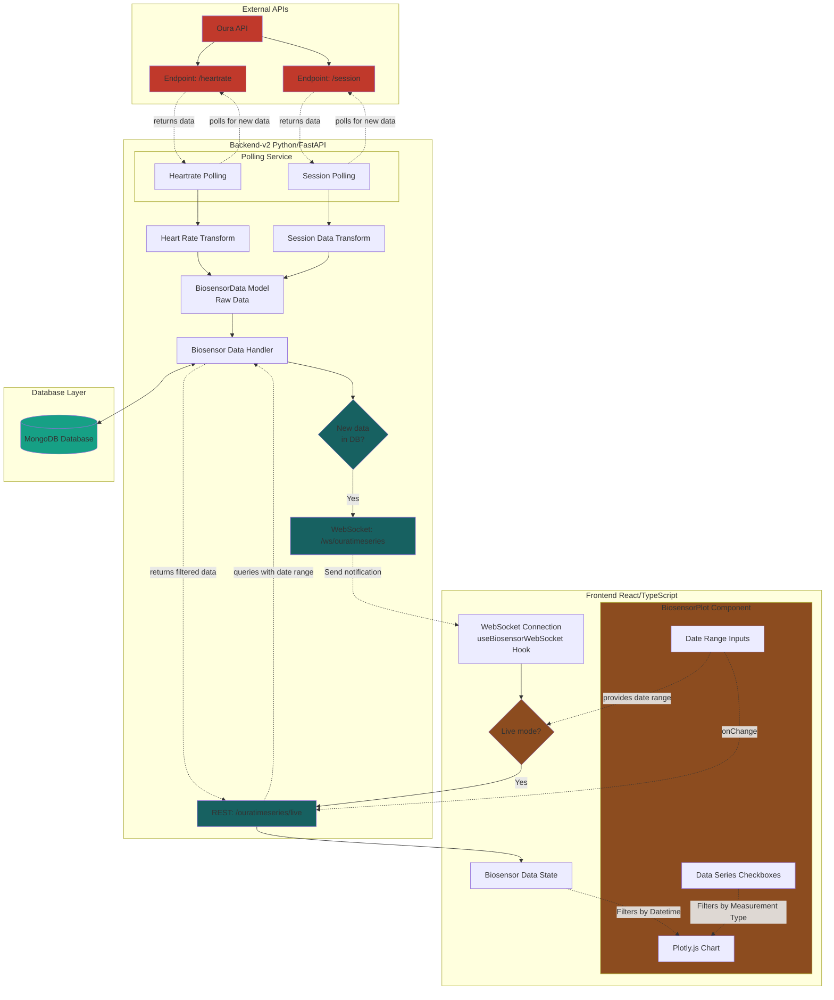
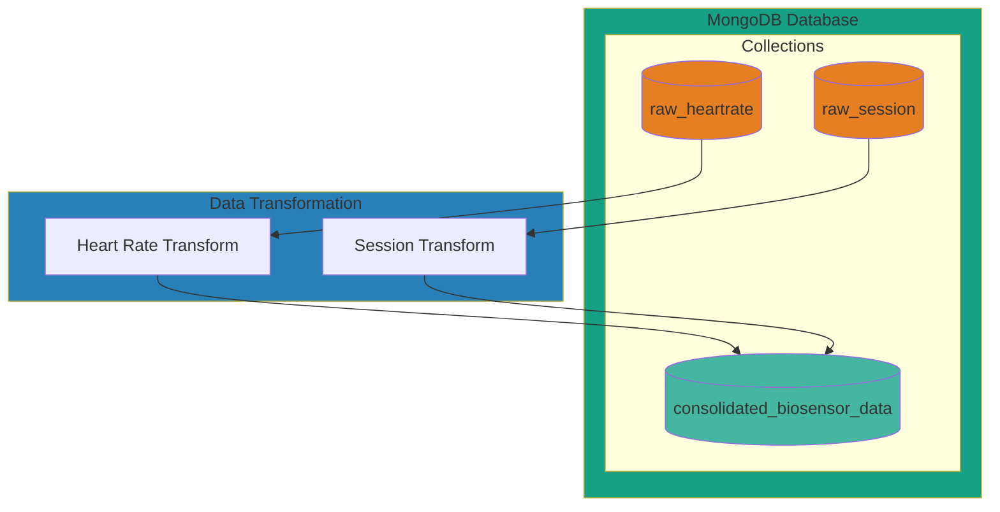
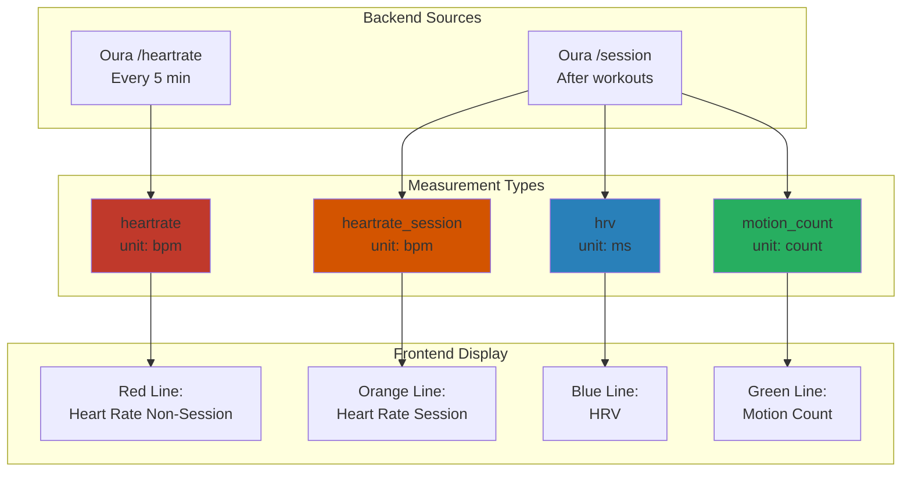
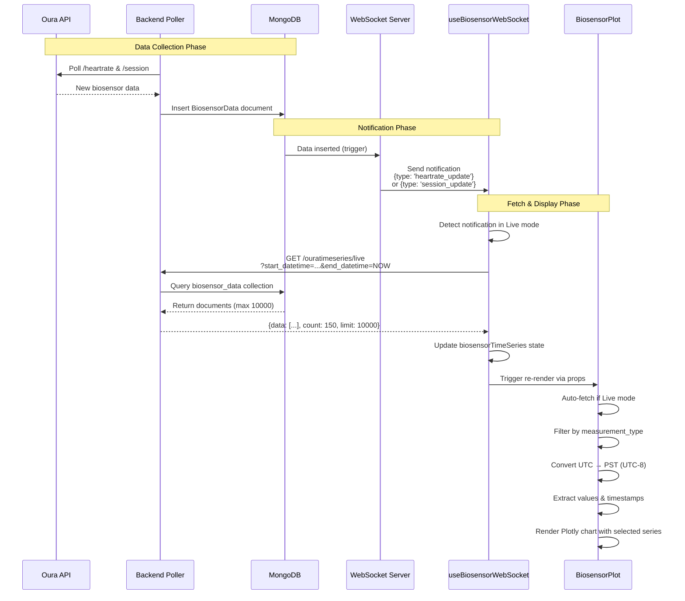
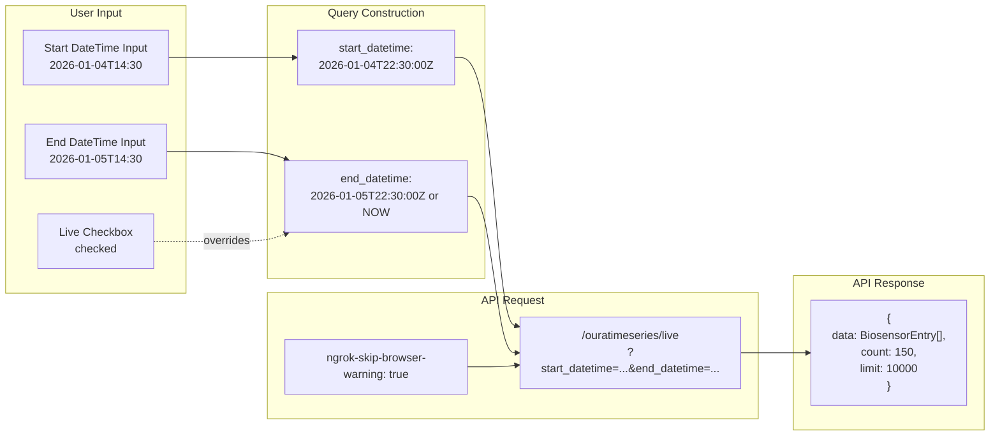

# Architecture   Diagrams

## Data Flow



### Legend

- **Solid arrows (→)**: Data flow
- **Dotted arrows (-.->)**: Control flow, triggers, or metadata (e.g., "provides date range", "onChange")
- **Bidirectional arrows (<-->)**: Two-way communication
- **Dark Red (#c0392b)**: External APIs (Oura API and endpoints)
- **Teal (#16a085)**: Database layer
- **Dark Teal (#176161)**: Backend endpoints and decision points
- **Brown (#8C4C1F)**: Frontend UI components and decision points
- **Decision diamonds {}**: Conditional logic points

## Database Architecture



### Database Collections

#### 1. **consolidated_biosensor_data** (Processed Data)
Primary collection for querying and visualization. Contains normalized, time-series biosensor data.

**Example Document:**
```json
{
  "_id": "695c0207404b8d8589393553",
  "timestamp": "2025-12-16T01:07:42.002Z",
  "measurement_type": "heartrate",
  "measurement_value": 48,
  "measurement_unit": "bpm",
  "sensor_mode": "heartrate",
  "data_source": "live",
  "device_source": "oura_ring_4",
  "source_endpoint": "usercollection/heartrate",
  "inserted_at": "2026-01-05T18:25:11.627620+00:00"
}
```

**Indexes:**
- `timestamp` (ascending) - for time-range queries
- `measurement_type` (ascending) - for filtering by type
- `(timestamp, measurement_type)` (compound) - optimized filtered queries

**Query Patterns:**
- Time-range: `find({ timestamp: { $gte: start, $lte: end } })`
- Type-filtered: `find({ measurement_type: 'heartrate', timestamp: { $gte: start } })`
- Live data: `find({ timestamp: { $gte: start } }).limit(10000)`

#### 2. **raw_heartrate** (Raw API Data)
Stores raw responses from Oura API `/heartrate` endpoint. Used for data archival and reprocessing.

**Example Document:**
```json
{
  "_id": "6954b70c93934cd13492481e",
  "data": {
    "data": [
      {
        "timestamp": "2025-12-16T01:07:42.002Z",
        "bpm": 48,
        "source": "live"
      }
      // ... 11,698 total entries
    ]
  },
  "inserted_at": "2025-12-31T05:39:24.722544+00:00",
  "source": "oura_api",
  "endpoint": "usercollection/heartrate"
}
```

**Purpose:**
- Archive raw API responses
- Enable data reprocessing if transformation logic changes
- Debugging and data validation

#### 3. **raw_session** (Raw Session Data)
Stores raw responses from Oura API `/session` endpoint containing workout/activity sessions.

**Example Document:**
```json
{
  "_id": "6959891bb6a3b4f1c07f171e",
  "data": {
    "data": [
      {
        "id": "292a1e36-cdf0-4a2c-a227-e9c0242f2c70",
        "day": "2025-12-28",
        "start_datetime": "2025-12-28T08:31:18.000-08:00",
        "end_datetime": "2025-12-28T08:41:18.000-08:00",
        "type": "meditation",
        "mood": "same",
        "heart_rate": { 
            "interval": 5,
            "items": [
                50.9,
                50.7,
                /* ... */
            ]
         },
        "heart_rate_variability": {
            "interval": 5,
            "items": [
                97,
                96,
                /* ... */
            ]
        },
        "motion_count": { 
            "interval": 5,
            "items": [
                0,
                12,
                /* ... */
            ]
            /* ... */ 
            }
      }
      // ... 14 total sessions
    ],
    "next_token": null
  },
  "inserted_at": "2026-01-03T21:24:43.497404+00:00",
  "source": "oura_api",
  "endpoint": "usercollection/session"
}
```

**Purpose:**
- Store complete session data including HRV, motion, and HR during activities
- Track workout types and mood data
- Enable future feature development using session metadata

## Measurement Types Flow



## Real-time Update Flow



## API Query Parameters

