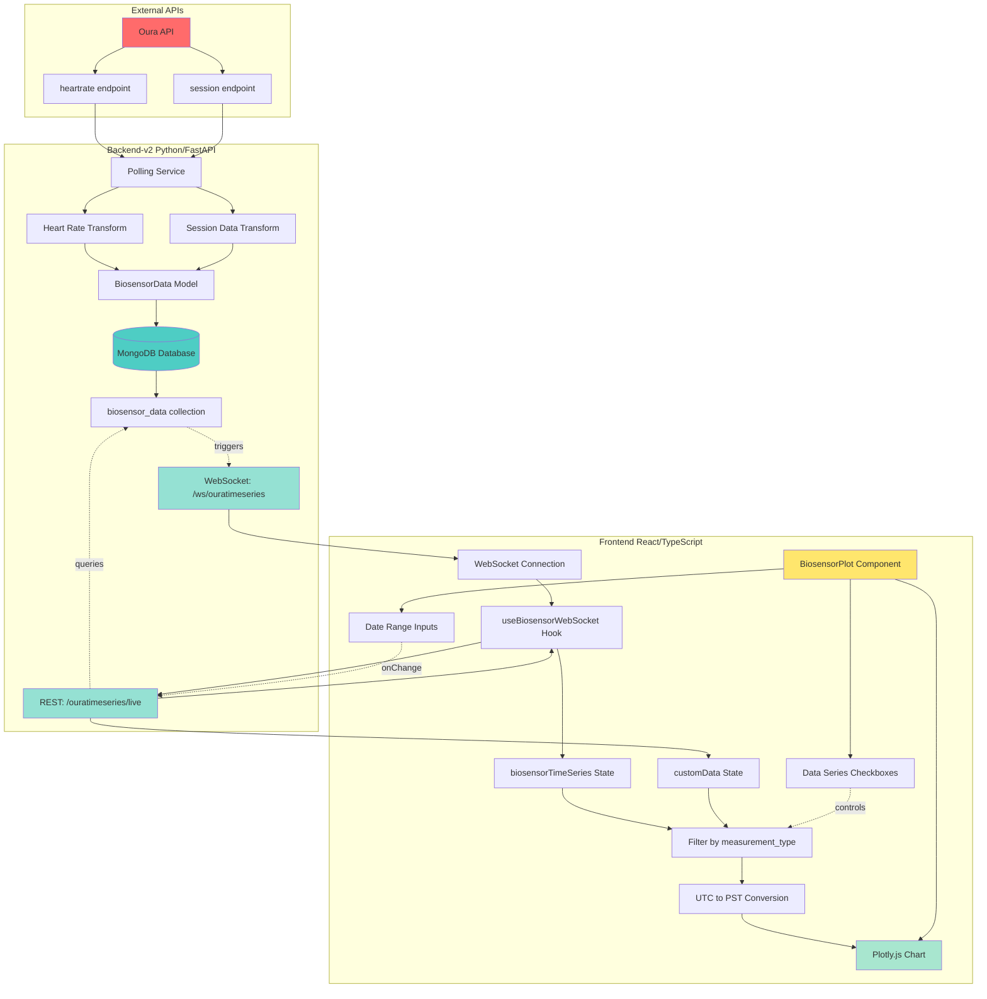
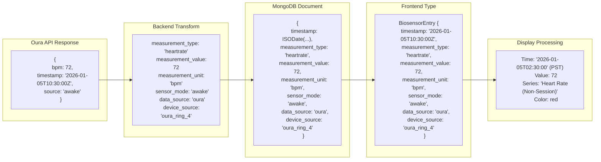
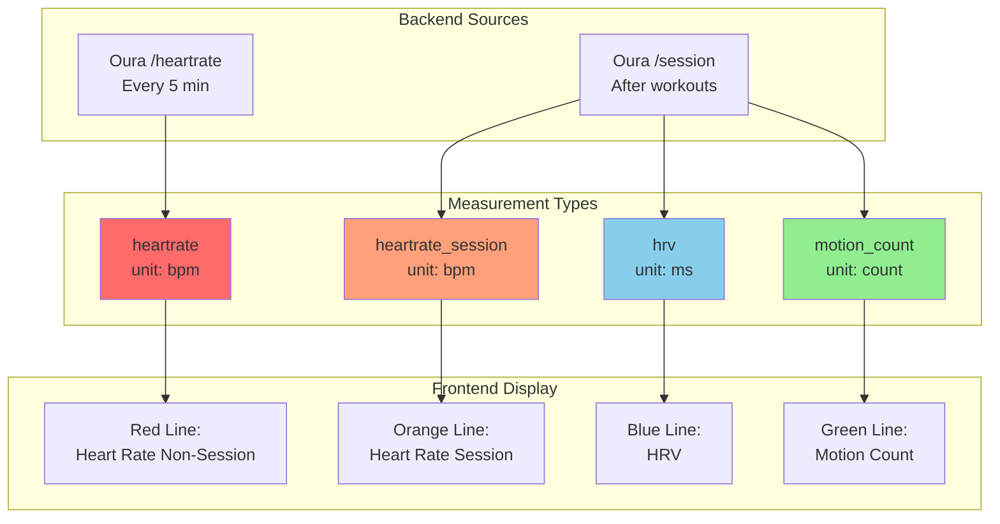
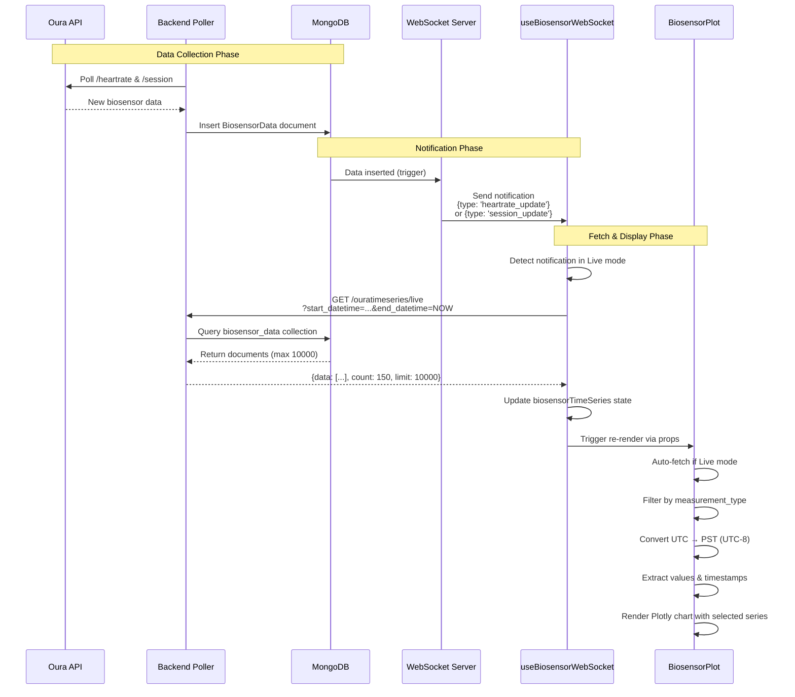
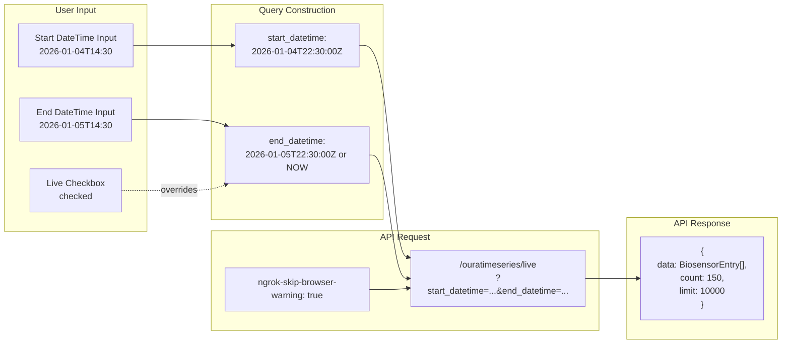
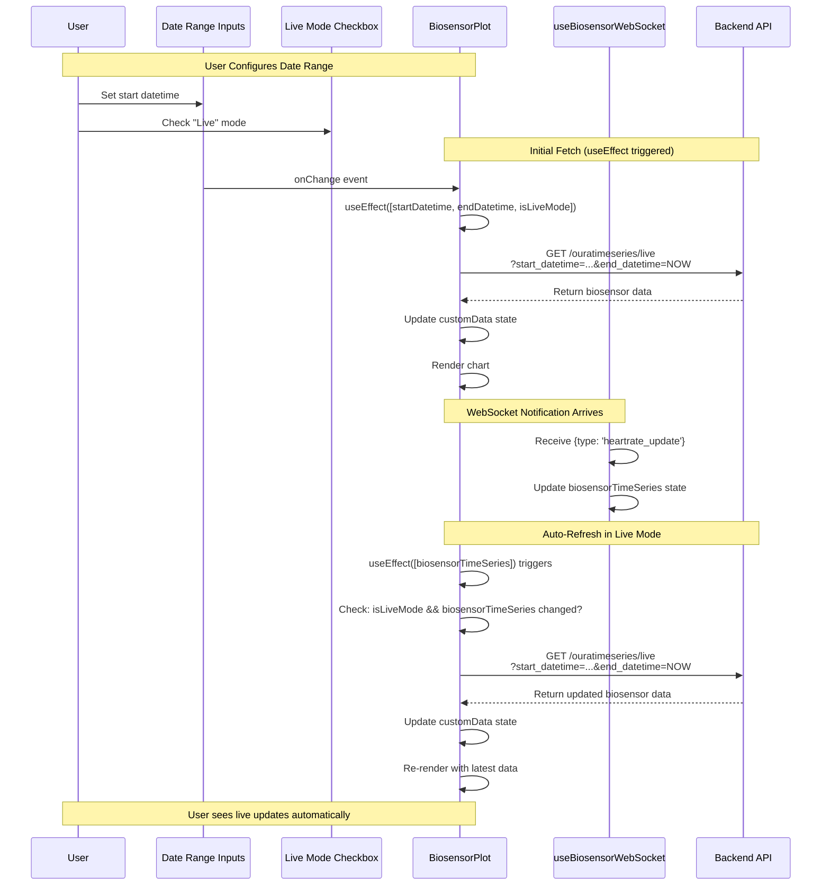
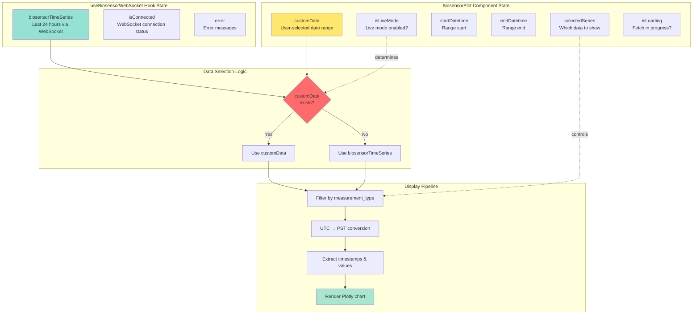
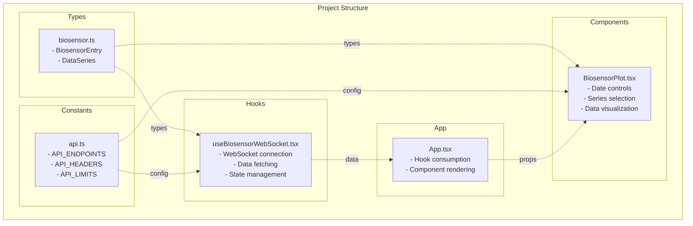

# Data Flow Diagram

## Complete System Data Flow

## Data Transformation Details

## Measurement Types Flow

## Real-time Update Flow

## API Query Parameters

## Live Mode Auto-Refresh Flow

## State Management Architecture

## File Organization

## Legend

- **Solid arrows (→)**: Data flow
- **Dotted arrows (-.->)**: Type definitions, configuration, or triggers
- **Red**: External APIs
- **Teal**: Backend services
- **Yellow**: Frontend components
- **Green**: Data display